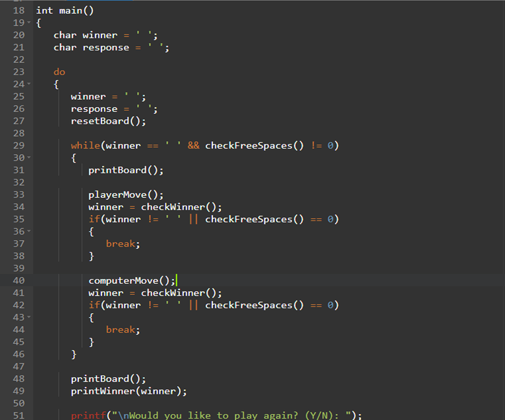

# Project ComPro Tic-Tac-Toe



## คำอธิบาย

เกม Tic-Tac-Toe ที่สร้างขึ้นโดยใช้ภาษา C เล่นได้ทุกเพศทุกวัย

## Getting Started

### Dependencies

* Describe any prerequisites, libraries, OS version, etc., needed before installing program.
* ex. Windows 10

### Installing

* How/where to download your program
* Any modifications needed to be made to files/folders

### Executing program

* How to run the program
* Step-by-step bullets
```
code blocks for commands
```

## Help

Any advise for common problems or issues.
```
command to run if program contains helper info
```

## Authors

Contributors names and contact info

ex. Dominique Pizzie  
ex. [@DomPizzie](https://twitter.com/dompizzie)

## Version History

* 0.2
    * Various bug fixes and optimizations
    * See [commit change]() or See [release history]()
* 0.1
    * Initial Release

## สมาชิกใน Project

[](https://github.com/Alongkorn-64070253) | [](https://www.quandl.com/) | []()
---|---
[นายอลงกรณ์ จุฑาทัศน์ 64070253](https://github.com/Alongkorn-64070253) |[นายตรัยธรรม แสงเดือน 64070150](https://www.quandl.com) |[นายชยณัฐ ศุทธยาลัย 64070136()
